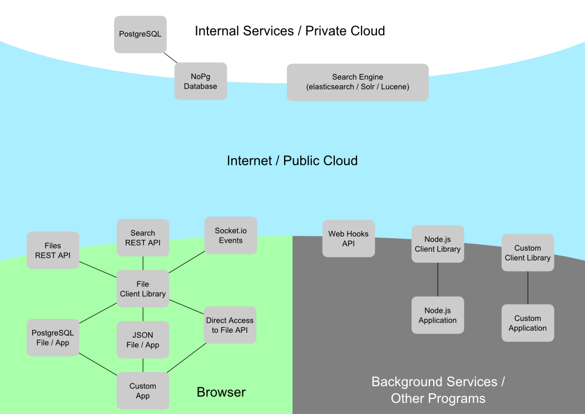
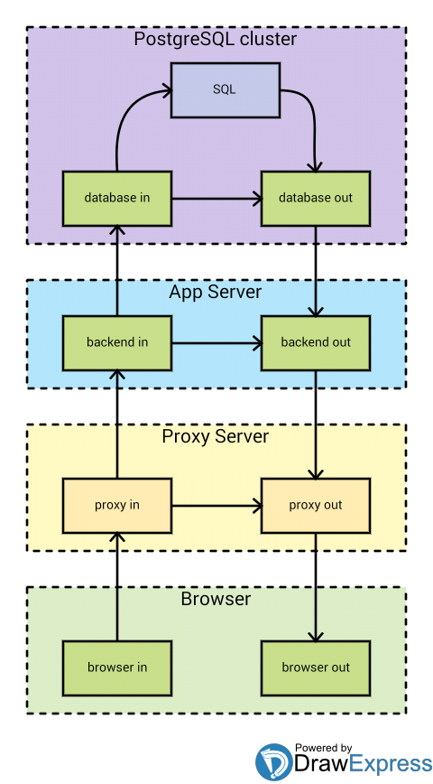

nor-stack
=========

Meta package which contains the centralized documentation and possible help utilities for our Node.js software stack

Sendanor Cloud Platform
-----------------------

Using this package
------------------

Although this package is actually -- at the moment -- possible to install and require, ***we do not suggest using it that way***.

This package is published as centarilized [documentation wiki](https://github.com/sendanor/nor-stack/wiki) for all of the projects.

We might publish CLI tool or other help utilities in the future.

Ideal Web Action Flow Model
---------------------------

This is our vision of ideal structure for web actions.

